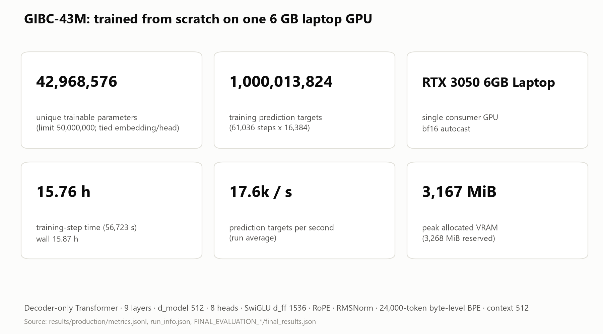
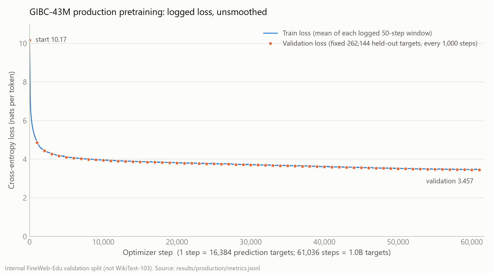
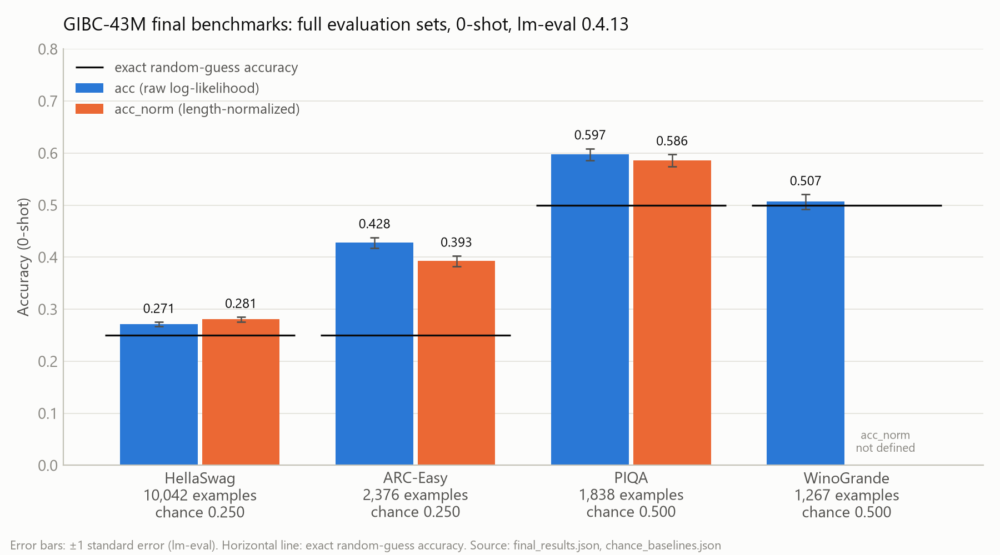

# GIBC-43M: a language model trained from scratch on a 6 GB laptop GPU

A 42,968,576-parameter decoder-only Transformer. Its tokenizer, data pipeline, training loop and
weights were all built for this project, from random initialization, on one NVIDIA RTX 3050
Laptop GPU (6 GB) in 15.76 hours.



## What I built

- **A foundation language model from scratch** under the GIBC V2 Track 01 limit of **50,000,000
  trainable parameters**. No pretrained weights, fine-tuning or distillation.
- **Its own tokenizer:** a 24,000-entry byte-level BPE trained on the project corpus.
- **Its own training system**, written in plain PyTorch: exact-resume checkpoints,
  hash-verified data, and a deterministic one-pass sampler.
- **1,000,013,824 training prediction targets** on consumer hardware, in 61,036 optimizer steps,
  with zero skipped or non-finite steps.
- **A verified evaluation path:** the checkpoint is exported to a Hugging Face Llama model and
  checked numerically against the source model before any benchmark runs.

Everything is reproducible from pinned data revisions and recorded hashes. This is a small model,
**not** a state-of-the-art one; the interesting part is how much of the pipeline can be done
correctly under tight parameter and hardware limits.

## Why this project

With 50M parameters and 6 GB of VRAM, every choice costs something:
- vocabulary size trades against depth;
- an untied output head alone would break the parameter limit;
- batch size is bounded by memory;
- a ~50-hour deadline bounds the number of training tokens.

The goal was to get the most language-modelling capability out of that budget, and to be able to
prove every number reported.

## Architecture

| | |
|---|---|
| Type | decoder-only causal Transformer (Llama-style, pre-norm) |
| Vocabulary | 24,000 (byte-level BPE, trained here) |
| Layers / d_model / heads | 9 / 512 / 8 (head dim 64, full multi-head attention) |
| MLP | SwiGLU, d_ff 1,536 |
| Positions | RoPE, θ = 10,000, unscaled; no learned position embeddings |
| Normalization | RMSNorm (eps 1e-5), final RMSNorm |
| Output head | **tied** to the token embedding (one shared tensor) |
| Biases | none |
| Context length | 512 |
| **Unique trainable parameters** | **42,968,576** (limit 50,000,000) |

Parameter accounting (V = 24,000, d = 512, L = 9, d_ff = 1,536):

```
embedding (= output head, tied)   V·d                   12,288,000
per layer                          4d² + 3·d·d_ff + 2d    3,408,896   × 9 = 30,680,064
final RMSNorm                      d                            512
total unique trainable                                   42,968,576
```

The count is verified programmatically on the real model and again on the exported HF model after
a fresh reload. Counting tensors *by name* would count the tied embedding twice (55,256,576). The
competition figure is the unique count.

## Data pipeline

1. **Source:** FineWeb-Edu `sample-10BT`, pinned revision `87f09149ef4734204d70ed1d046ddc9ca3f2b8f9`.
   Only the rows needed were read, via range reads of individual row groups; the 28 GB sample was
   never downloaded.
2. **Wikipedia-source exclusion:** documents whose URL host is `wikipedia.org` or a subdomain were
   dropped before tokenizer training and corpus building (9,857 documents). This *reduces* direct
   overlap with WikiText. It is **not** complete benchmark decontamination: mirrored or quoted
   text can remain.
3. **Resumable acquisition:** a 100 MB pilot, then 27 hash-verified chunks continuing from the
   exact position where the pilot stopped. The pilot is included exactly once.
4. **Exact-duplicate audit:** 4,821 duplicate train documents were counted and kept. 87 validation
   documents whose exact text also appears in train were removed from validation.
5. **Immutable token files:** 1,100,000,632 train tokens and 10,753,165 validation tokens, stored
   as read-only uint16 files. They are SHA-256 verified at every training start and resume.
6. **Sampler:** a seeded, one-pass shuffle of non-overlapping 513-token windows, so every target
   is predicted at most once. 1,953,152 of 2,148,438 windows were used; the rest were never sampled.

## Tokenizer

- **Training:** byte-level BPE trained from scratch (HF `tokenizers`) on the pilot's training
  split: 20,765 documents, 99 MB. It uses the full 256-byte alphabet, so it has no UNK token and
  every string round-trips exactly.
- **Size:** exactly **24,000** entries.
- **Special tokens:** one, `<|endoftext|>` = **id 0**, appended once after each document. There is
  no BOS and no PAD token.
- **Literal text:** raw text containing the characters `<|endoftext|>` is encoded as ordinary
  bytes, never as id 0. This is enforced in our loader and in the HF export.
- **Compression:** about 4.52 UTF-8 bytes per token on FineWeb-Edu.

## Training

| | |
|---|---|
| Hardware | NVIDIA GeForce RTX 3050 6GB Laptop GPU, Ryzen 5 6600H, 16 GB RAM, Windows 11 |
| Precision | bf16 autocast, fp32 master weights, TF32 |
| Batch | micro-batch 8 × 512 tokens × gradient accumulation 4 = **16,384 targets per update** |
| Optimizer | fused AdamW, β = (0.9, 0.95), eps 1e-8, weight decay 0.1 (2-D weights only), grad clip 1.0 |
| LR schedule | peak **1e-3**, 256 warmup steps, cosine decay to 1e-4 over 61,036 steps |
| LR choice | a predeclared rule applied to two 1,024-step sanity runs (6e-4 vs 1e-3) |
| Targets | **1,000,013,824** (61,036 steps) |
| Time | **15.76 h** in training steps (56,723 s); 15.87 h wall |
| Throughput | **17,630 targets/s** run average (every 50-step window: 17,511–17,718) |
| Peak memory | **3,167 MiB allocated** (3,268 MiB reserved) of 6 GB |
| Stability | 0 skipped steps, 0 non-finite values, 0 interruptions |



Final internal validation (a held-out FineWeb-Edu subset of 262,144 targets): loss **3.4574**,
perplexity **31.74**. This is **not** WikiText-103 perplexity.

## Results

All benchmarks were run once, on the full evaluation sets, using the final checkpoint:
- **Harness:** lm-evaluation-harness 0.4.13, **0-shot**, float32, `max_length` 512.
- **Model:** the local HF export of our weights only.
- **Metrics:** both `acc` and `acc_norm` are reported; `acc_norm` is not defined for WinoGrande.

| Benchmark | Split (examples) | acc | acc_norm | Random chance |
|---|---|---|---|---|
| HellaSwag | validation (10,042) | 0.2711 ± 0.0044 | 0.2806 ± 0.0045 | 0.2500 |
| ARC-Easy | test (2,376) | 0.4280 ± 0.0102 | 0.3927 ± 0.0100 | 0.2502 |
| PIQA | validation (1,838) | 0.5974 ± 0.0114 | 0.5860 ± 0.0115 | 0.5000 |
| WinoGrande | validation (1,267) | 0.5067 ± 0.0141 | n/a | 0.5000 |

| Language modelling | Value |
|---|---|
| **WikiText-103 test token perplexity under the documented project methodology** | **46.245** (303,524 tokens scored) |
| Internal FineWeb-Edu validation perplexity (training monitor; not a benchmark) | 31.74 |

The WikiText-103 figure is a per-token perplexity under our own 24k tokenizer, not word
perplexity. Its exact method is described in [docs/RESULTS.md](docs/RESULTS.md#7-wikitext-103).
"Random chance" is the exact expected accuracy of guessing, computed from each task's number of
answer options.



The full technical record (hashes, environment, dataset revisions, parity numbers) is in
**[docs/RESULTS.md](docs/RESULTS.md)**; the model card is **[MODEL_CARD.md](MODEL_CARD.md)**.

## Efficiency

- 42.97M trainable parameters: 86% of the cap, with the output head shared with the embedding.
- 1.0B training targets in 15.76 hours on one 6 GB laptop GPU, at 17.6k targets/s.
- Peak allocated memory of 3.1 GiB, so no activation checkpointing was needed.
- The full evaluation suite (four benchmarks plus WikiText-103) runs in about 11 minutes on the
  same GPU.

These are measurements from one machine and one run. They are not general hardware claims.

## Evaluation methodology

- **Benchmarks:**
  - lm-evaluation-harness 0.4.13 standard HF backend, with unchanged task definitions (all v1.0),
    0-shot.
  - 0-shot is the project's own choice, since the organizers have not specified a few-shot
    protocol.
  - float32, `max_length` 512. No request needed truncation: the longest was 261 tokens.
- **Export parity (gate before evaluation):** the checkpoint is exported to `LlamaForCausalLM`
  with tied weights and reloaded in a fresh process from local files only. There:
  - the parameter count (42,968,576) and the tie are confirmed;
  - all 84 weight tensors are equal;
  - the tokenizer matches on 305 texts;
  - CPU logits match exactly;
  - CUDA logits match within 4.0e-5;
  - lm-eval's own log-likelihood path agrees with ours within 3.8e-6.
- **WikiText-103:**
  - `Salesforce/wikitext` / `wikitext-103-raw-v1` / test at revision
    `b08601e04326c79dfdd32d625aee71d232d685c3`;
  - rows concatenated unchanged, with one EOT used as context only;
  - rolling 512-token windows with stride 256, every token scored exactly once;
  - perplexity = exp(total NLL / 303,524).
  - The method was fixed before the final model existed.
- **Benchmark dataset revisions and task configs** are recorded in
  `results/FINAL_EVALUATION_production_step_0061036/`.

## Reproducibility

The commands assume Windows PowerShell, Python 3.11, and an external work directory, since large
artifacts never live in the repo. The full environment is recorded in
[results/env/pip-freeze.txt](results/env/pip-freeze.txt), a sanitized copy; see [results/env/README.md](results/env/README.md).

```powershell
# Environment
$env:GIBC_WORK_DIR = "C:\gibc-work"   # any folder outside the repo (and outside OneDrive)
$env:HF_HOME = "$env:GIBC_WORK_DIR\hf_home"
py -3.11 -m venv "$env:GIBC_WORK_DIR\venv"; & "$env:GIBC_WORK_DIR\venv\Scripts\Activate.ps1"
pip install torch==2.14.0 --index-url https://download.pytorch.org/whl/cu126
pip install -r requirements.txt; pip install -e .
python -m pytest                                              # 218 tests, CPU + small CUDA checks
python scripts/param_budget.py configs/model/gibc_43m.json    # analytic count
python scripts/verify_params.py configs/model/gibc_43m.json   # instantiated count + tie
```

**Quick smoke reproduction** (about 15 minutes; 100 MB of data). It exercises every stage without
the 1B-token run:

```powershell
python scripts/acquire_data.py --config configs/data/pilot.json --name pilot       # bounded pilot
python scripts/train_tokenizer.py --data-name pilot                               # tokenizer
python scripts/prepare_tokens.py --data-name pilot                                # uint16 tokens
python scripts/train.py --config configs/train/smoke.json --overwrite --stop-at-step 30   # train, checkpoint, exit
python scripts/train.py --resume "$env:GIBC_WORK_DIR\runs\smoke\checkpoints\step_0000030.pt"   # exact resume
python scripts/generate.py --checkpoint "$env:GIBC_WORK_DIR\runs\smoke\checkpoints\final_step_0000060.pt" --prompt "Water"
```

**Full production reproduction** (about 1 hour of data preparation, then about 16 hours of
training on an RTX 3050):

```powershell
python scripts/acquire_production.py --config configs/data/production.json        # resumable chunks
python scripts/build_production_tokens.py --config configs/data/production.json    # audit + immutable tokens
python scripts/verify_production_data.py --config configs/train/production.json    # hash / window preflight
python scripts/train.py --config configs/train/production.json                     # 61,036 steps
#   interrupted? -> python scripts/train.py --resume <newest checkpoint in runs\production\checkpoints>
python scripts/export_hf.py --checkpoint "$env:GIBC_WORK_DIR\runs\production\checkpoints\final_step_0061036.pt"
python scripts/verify_hf_export.py --export "$env:GIBC_WORK_DIR\exports\production_step_0061036"
python scripts/eval_lm_eval_final.py --export "$env:GIBC_WORK_DIR\exports\production_step_0061036" --out results\FINAL_EVALUATION_production_step_0061036
python scripts/eval_wikitext103.py --export "$env:GIBC_WORK_DIR\exports\production_step_0061036" --revision b08601e04326c79dfdd32d625aee71d232d685c3
python scripts/demo.py --prompt "Photosynthesis is the process by which"          # local generation
```

## Repository structure

```
configs/     model, data-acquisition and training configs (JSON, strict keys)
gibc/        library: tokenizer, data + sampler, model, training loop, checkpoints, HF export, scoring
scripts/     entry points: data, tokenizer, training, benchmark, export/verify, evaluation, demo, figures
tests/       218 pytest tests (parameter count, tying, causality, resume, sampler, parity, ...)
results/     committed evidence: manifests, tokenizer, metrics, final evaluation, figures
docs/        RESULTS.md, PLAN.md (stage-by-stage record), AI_ASSISTANCE.md, submission material
```

## Limitations

- **Generation is weak.** Greedy decoding often loops, and sampled text is fluent but frequently
  wrong. For example, the model explains water boiling at altitude as being "because it is too
  cold", and answers "60 miles" to a three-hour speed question. See
  [generation_samples.json](results/FINAL_EVALUATION_production_step_0061036/generation_samples.json).
- **WinoGrande is at chance** (0.507 vs 0.500, within about 0.5 standard error), and HellaSwag is
  only slightly above chance. ARC-Easy and PIQA are clearly above chance but far from larger models.
- **Small scale:** 43M parameters, 1.0B training targets, and a 512-token context.
- **Contamination:** source filtering excludes Wikipedia URLs only. It is not a guarantee against
  benchmark or WikiText overlap in web text.
- **The WikiText-103 figure depends on the tokenizer:** it is per-token under our 24k BPE and is
  not comparable to word-level perplexities or to other tokenizers' numbers.
- **One run:** there was only one production pretraining run, with no seed repeats. Only two
  learning rates were tried, in short 1,024-step runs.
- **Untested:** the model has had no instruction tuning and no safety evaluation.

## AI-assisted development

AI tools were used for **development only**; none produced the model's weights, data or results.
**Claude Code (Opus 5.5)** was the primary implementation agent, **ChatGPT** the technical lead
for planning, orchestration and review, **Codex / GPT "Astra"** carried out independent
review and compliance audits, and **Context7 MCP** was used for documentation lookup. Every number
here comes from runs on the hardware above. Details: [docs/AI_ASSISTANCE.md](docs/AI_ASSISTANCE.md).

## License and attribution

- **Project license:** not yet chosen; to be set by the author before public release.
- **Training data:** FineWeb-Edu (HuggingFaceFW), released under ODC-By 1.0 and subject to
  Common Crawl's terms of use.
- **Evaluation data:** WikiText-103 (Salesforce), HellaSwag, ARC (AI2), PIQA and WinoGrande,
  used under their respective licenses; see each Hugging Face dataset card.
